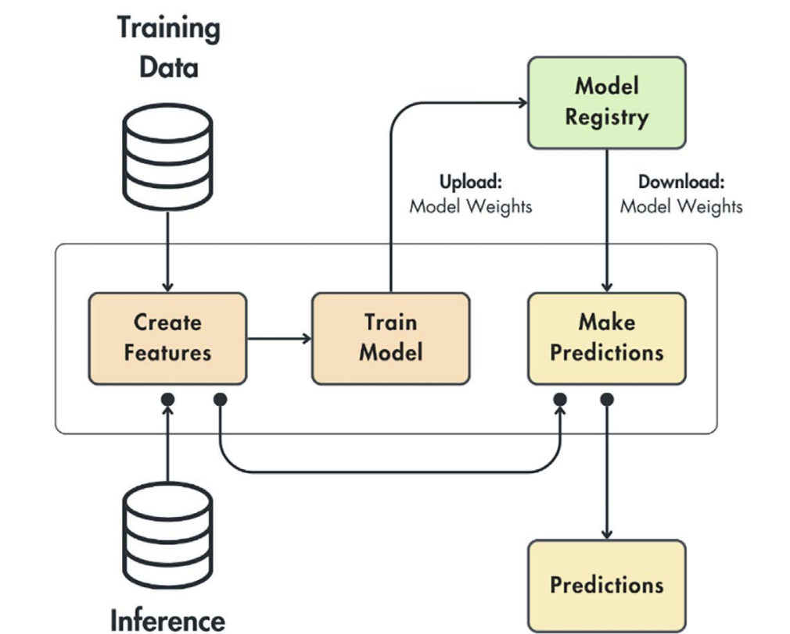
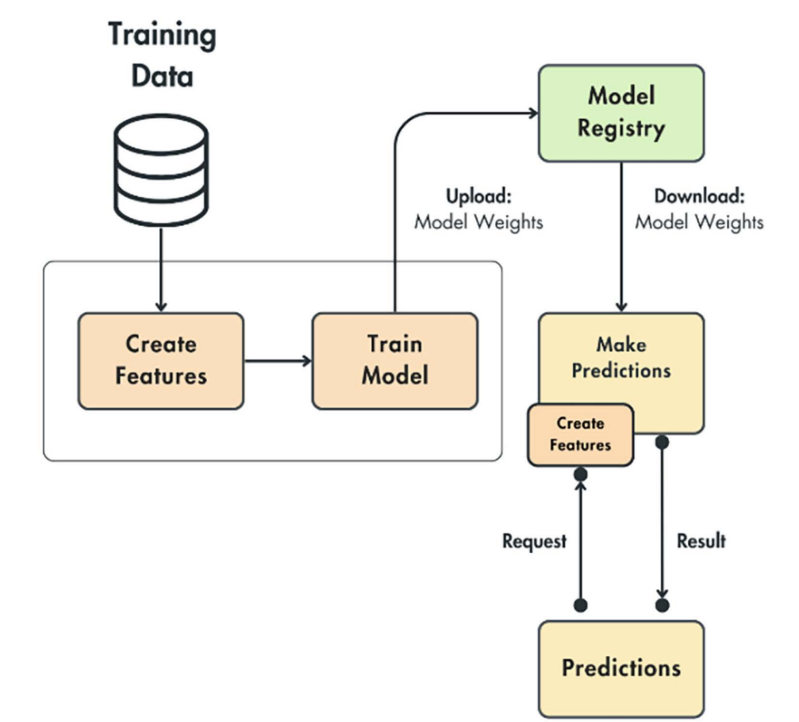
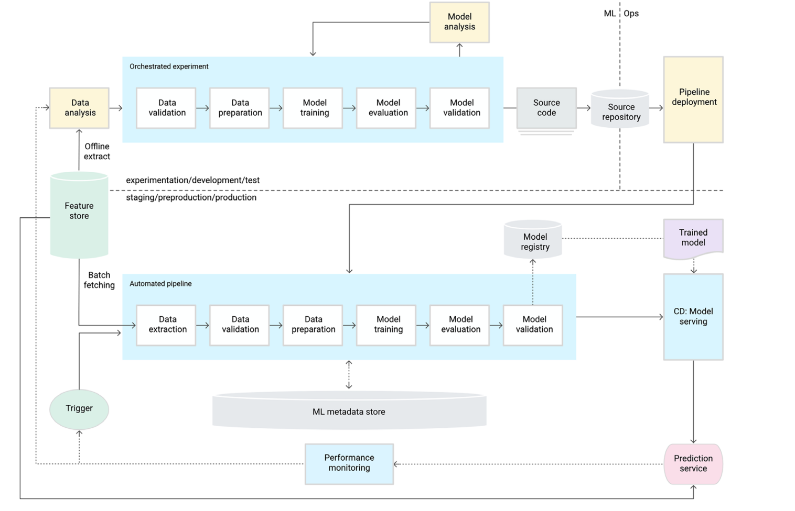
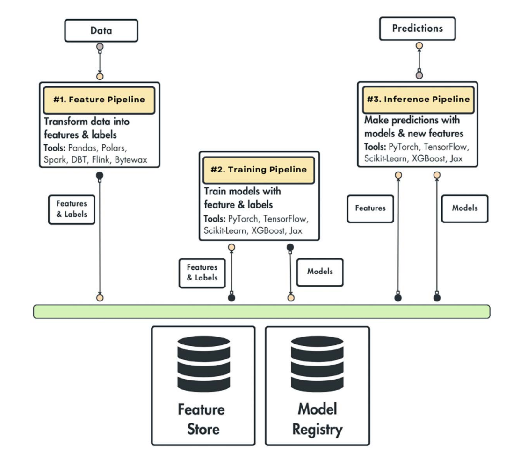
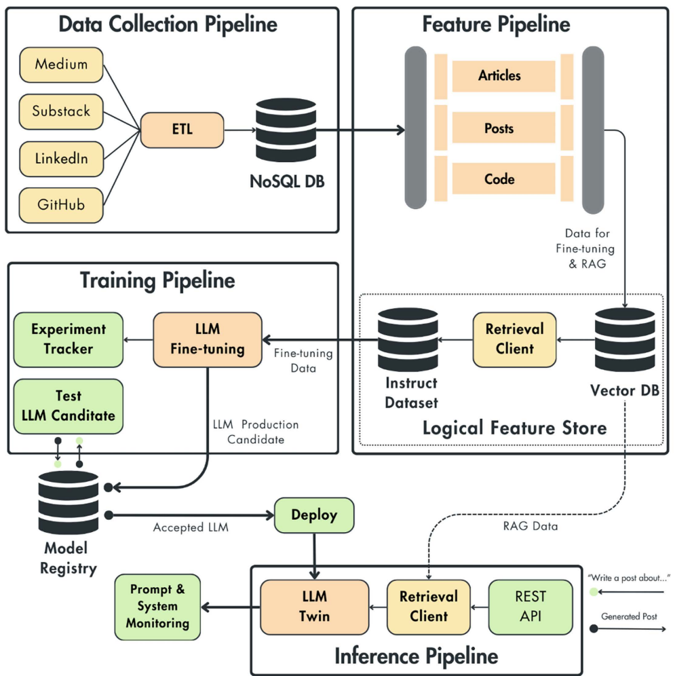

Three planning steps we need to go through before building.
- Why? - dreaming, problem we are trying to solve - [llm-twin](#1-understanding-llm-twin)
- What? - MVP scope, being realistic about what we can achieve - [MVP](#2-mvp-plan)
- How? - Exact technicalities 
        - [FTI Pipeline](#3-building-ml-systems-with-featuretraininginference-pipelines)
        - 

## 1. Understanding LLM Twin

An AI Character that writes like you, Digital projected version. We train on our writing style and use it to produce content like ours.

#### Why it matters
- To build a personal brand, for content creators on Social media platforms. We can feed skeleton of idea and it generates.

- We can adapt to other use cases like may be resume/cover letter writer, cold email writer

         Difference  b/w copilot and LLM twin

         Copilot augments users in programming, writing, content creation tasks

         LLM twin is a digital version of you it mimics your voice, personality and writing style

         we could combine them and make powerful LLM twin copilot

> No Immoral scenarios, Strictly you use your data which you want to project.

#### Why not use ChatGPT (or so)

- Not personalized, wordy, generic. To build a brand and get long term success, we want an original voice that is critical. Also Mis-information due to hallucination, Tedious manual prompting.

Giving various data sources like blogs written by you etc and generate content that you can reproduce and evaluating output is hard.

So we want to automate the following

```
> Data Collection
> Data Preprocessing
> Data Storage, Versioning and retrieval
> LLM fine tuning
> RAG
> Content generation evaluation
```

We can use Open AI's GPT API, just the llm framework should be LLM-agnostic. Create product data centric model agnostic, so that you can expirement with multiple models.

## 2. MVP Plan

Purpose is to gather market insights with minimal effort. We ship a product with just enough features to draw in early users and test the viability of concept in initial stages of development.

Powerful strategy -> Accelerated time-to-market, Idea validation,Market research, Risk minimiation. Stick to the *V* in MVP. Make it viable. Don't ship half implemented features.

Plan:
- Collect data (from Linkedin, Github etc)
- Fine-tune an open-source LLM using the collected data.
- Populate a vector database using our digital data for RAG
- Create posts using user prompt, RAG to reuse and reference old content, New articles/papers as additional knowledge to LLM
- Simple web interface to interact with LLM Twin to configure links, trigger collection, send prompts or external links to resources.

## 3. Building ML systems with feature/training/inference pipelines

**FTI architecture**

Building production ready ML systems is much more than just training a model. Training model is straight forward step in most use cases. But it becomes complex to decide architecture and hyperparameters - it becomes a research problem. 

Training a model with high accuracy is valuable but training on static dataset is not robust. we have to consider how to do following:

- Ingest, clean and validate fresh data
- Training vs inference setups
- Compute and serve features in the right env
- Serve the model in a cost-effective way
- Version, track and share the datasets and models
- Monitor your infrastructure and models
- Deploy the model on a scalable infrastructure
- Automate the deployments and training

Theses are the problems an ML Engineer or MLOps need to consider. The research or data science team is often responsible for training the model.

**Common Elements of ML System**

Google cloud team suggests that a mature ML system requires these components.

        Data collection, Testing and debugging, Resource management, Configs, Data Verification, Model Analysis, Automation, Feature Engineering, Serving infrastructure, Metadata management, Process management, Monitoring, ML Code

Along with ML Code, there are many moving pieces. We need to consider these when productionizing an ML model. How to connect all these components. The boilerplate solution for ML?

Similar to software where we have DB, business logic, UI layer.

Let us look at some previous solutions unsustainable for building scalable ML systems.

**The issue with previous solutions**
- Monolithic batch pipeline architecture:

        - Features are not reusable
        - does not scale independently
- Stateless Real time architecture:

        - We have to transfer whole state through client request to compute features
        example: instead of passing user ID, we need to pass name, age, gender, movie history to recommend movies. For this client needs to access and know the state. 
        Another example, If we didn't store records in vecor DB and pass them along with user query, client must know how to query and retrieve documents - Antipattern.
- Google cloud architecture:

        - complex and non intuitive

### The solution – ML pipelines for ML systems


- Flexibility - each pipeline can be run on different process/HW, written differently, different team, scaled differently. 

**The feature pipeline**

- Takes raw data as input, processes it, outputs features and labels required for training and inference. 
- Instead of directly passing, it stores, versions, tracks and shares features. We can reuse the features.

Since data is versioned, we can ensure the training and inference features match. Thus, avoiding the training-serving skew problem.

**The training pipeline**

- Takes features and labels as input, trains the model and outputs a trained model artifact.
- Similar to feature store, we store models in model registry. store, version, track and share with inference.
- Model registry also supports metadata to know which features, labels, versions used to train.

**The Inference pipeline**
- Takes features and labels from feature store, trained model from model registry and with these predictions can be made (batch/real-time)

- we can easily upgrade or rollback deployment of model, quickly change connections between model and features.

Note that the feature pipeline can be complex and again contain multiple services - one to validate data, another to compute features etc.

## 4. Design - System architecture of LLM Twin

**Technical Details**

- Data:
  - Collect data from linkedin etc completely autonomously and on schedule
  - standardize the crawled data and store it in a data warehouse
  - clean the raw data
  - create instruct datasets for fine-tuning an LLM
  - Chunk and embed the cleaned data. Store the vectorized data into a vector DB for RAG

- Training:
  - Fine tune LLM of various sizes (7B..70B parameters)
  - Fine-tune on instruction datasets of multiple sizes
  - Switch between LLM types (Mistral, Llama, GPT)
  - Track and compare experiments
  - Test potential production candidates before deploying
  - Automatically start training when new instruction dataset is available

- Inference:
  - A REST API for clients to interact with LLM Twin
  - Access to vector DB in real time for RAG
  - Inference with LLMs of various sizes
  - Autoscaling based on user requests
  - Automatically deploy the LLMs that pass the evaluation 

- The system will support the following LLMOps features:
  - Instruction dataset versioning, lineage and reusability
  - Model versioning, lineage, reusability
  - Experiment tracking
  - Continuos training, integration, delivery (CT/CI/CD)
  - Prompt and system monitoring

### How to apply FTI pipeline design.
We need 4 components. 3 being FTI and one being data pipeline that data engineering team owns. ML engineering team owns the FTI pipeline.
 

**Data Collection Pipeline**

- Collect data from Linkedin, Github, Blogs, etc
- Use ETL (**E**xtract, **T**ransform, **L**oad ) pattern to get data from platforms, standardize it and load it into a data warehouse.
- The output of this component will be a NoSQL DB - MongoDB (usually not a data warehouse but will act as one for our simple case)

Collected data is binned into 3 categories:
Articles (Medium, Substack) | Posts (LinkedIn) | Code (GitHub)

Each category will be processed differently like chunking strategy could be different and we can switch the source from LinkedIn to X or GitHub to GitLab. To make this modular we use an ETL step.

**Feature Pipeline**
- It processes 3 categories differently - Articles, Posts, Code. 
- 3 main processing steps for fine-tuning and RAG: Cleaning, Chunking and embedding
- It creates two snapshots of the digital data - one after Cleaning (used for fine-tuning) and one after embeding (used for RAG)
- It uses a logical feature store instead of a specialized feature store

Central piece of RAG - Vector DB - We can access data points using their ID and collection name - NoSQL DB

**Training Pipeline**
- It takes instruct datasets from feature store, fine-tunes an LLN with it and stores the weights in model registry. Whenever a new instruct dataset available it triggers the training pipelines and fine-tunes an LLM

Initial stages, data science team owns it to run experiments and do hyperparameter tuning to pick the best set. An experiment tracker will be used to log everything of value and compare. Ultimately they will pick one and then it is stored in model registry. Once this `Experimentation phase` is over, we will automate this process, known as *Continuous Training*

Then Testing pipeline is triggered for detailed analysis and if it passes all the tests to see latest candidate is better than production candidate it can deploy to production. With an expert in loop to check the reports and approve.

**Inference Pipeline**
- Loads a fine-tuned LLM from model registry , from the logical feature store it acceses the vector DB for RAG. Takes in client requests through REST API as queries, uses the fine tuned LLM and access to vector DB to carry out RAG and answer the query.

All the client queries, enriched prompts using RAG and generated answers are sent to prompt monitoring system to analyze, debug and better understand the system. It can also trigger alarms to take manual/automated actions.

### Final Thoughts on FTI Design and LLM Twin Architecture

This is a tool to clarify how to design ML systems. Not to be rigid, we switched dedicated feature store to a logical one. the important thing is the properties of the feature store - versioned and reusable training dataset.

- Data Collection and Feature Pipeline - mostly CPU based , ❌ powerful machines
- Training pipeline - GPU based to load LLM, finetune it, scales vertically adding more GPUs
- Inference pipeline - It is in the middle, still needs powerful enough to serve user fast but less compute intensive than training. scales horizontally based on number of client requests.
